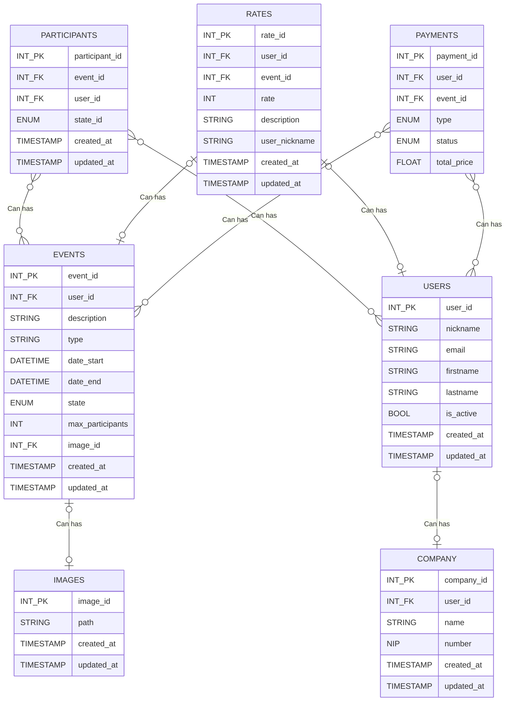

```mermaid
erDiagram
	USERS o| -- |o COMPANY : "Can has"
	USERS {
		INT_PK user_id
		STRING nickname
		STRING email
		STRING firstname
		STRING lastname
		BOOL is_active
		TIMESTAMP created_at
		TIMESTAMP updated_at
	}
  COMPANY {
		INT_PK company_id
		INT_FK user_id
		STRING name
		NIP number
		TIMESTAMP created_at
		TIMESTAMP updated_at
  }
	EVENTS |o -- o| IMAGES : "Can has"
  EVENTS {
		INT_PK event_id
		INT_FK user_id
		STRING description
		STRING type
		DATETIME date_start
		DATETIME date_end
		ENUM state
		INT max_participants
		INT_FK image_id
		TIMESTAMP created_at
		TIMESTAMP updated_at
	}
	IMAGES {
		INT_PK image_id
		STRING path
		TIMESTAMP created_at
		TIMESTAMP updated_at
	}
	PARTICIPANTS }o -- o{ EVENTS : "Can has"
	PARTICIPANTS }o -- o{ USERS : "Can has"
	PARTICIPANTS {
		INT_PK participant_id
		INT_FK event_id
		INT_FK user_id
		ENUM state_id
		TIMESTAMP created_at
		TIMESTAMP updated_at
	}
	RATES |o -- o| EVENTS : "Can has"
	RATES |o -- o| USERS : "Can has"
	RATES {
		INT_PK rate_id
		INT_FK user_id
		INT_FK event_id
		INT rate
		STRING description
		STRING user_nickname
		TIMESTAMP created_at
		TIMESTAMP updated_at
	}
	PAYMENTS }o -- o{ EVENTS : "Can has"
	PAYMENTS }o -- o{ USERS : "Can has"
	PAYMENTS {
		INT_PK payment_id
		INT_FK user_id
		INT_FK event_id
		ENUM type
		ENUM status
		FLOAT total_price
	}
```
