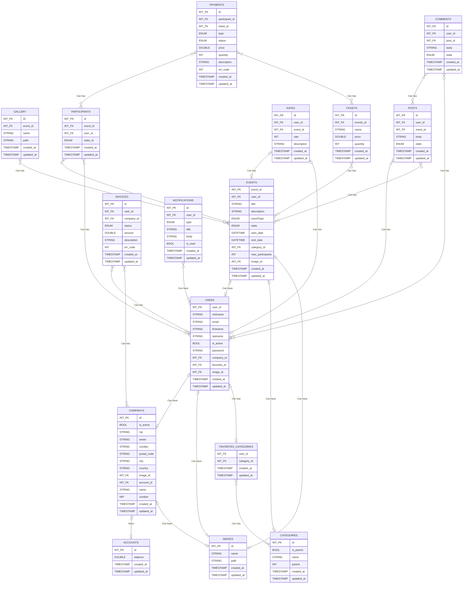

```mermaid
erDiagram
	USERS o| -- |o COMPANYS : "Can have"
	USERS o| -- |o IMAGES : "Can have"
	USERS o| -- |o FAVORITES_CATEGORIES : "Can has"
	USERS {
		INT_PK user_id
		STRING nickname
		STRING email
		STRING firstname
		STRING lastname
		BOOL is_active
		STRING password
		INT_FK company_id
		INT_FK favorites_id
		INT_FK image_id
		TIMESTAMP created_at
		TIMESTAMP updated_at
	}

	COMPANYS o| -- |o ACCOUNTS : "Have"
	COMPANYS o| -- |o IMAGES : "Can have"
  	COMPANYS {
		INT_PK id
		BOOL is_active
		STRING nip
		STRING street
		STRING number
		STRING postal_code
		STRING city
		STRING country
		INT_FK image_id
		INT_FK account_id
		STRING name
		NIP number
		TIMESTAMP created_at
		TIMESTAMP updated_at
  	}

	ACCOUNTS {
		INT_PK id
		DOUBLE balance
		TIMESTAMP created_at
		TIMESTAMP updated_at
	}

	EVENTS |o -- o| USERS  : "Can have"
	EVENTS |o -- o| CATEGORIES  : "Can have"
	EVENTS |o -- o| IMAGES : "Can have"
  	EVENTS{
		INT_PK event_id
		INT_FK user_id
		STRING title
		STRING description
		ENUM eventType
		ENUM state
		DATETIME start_date
		DATETIME end_date
		INT_FK category_id
		INT max_participants
		INT_FK image_id
		TIMESTAMP created_at
		TIMESTAMP updated_at
	}

	IMAGES {
		INT_PK id
		STRING name
		STRING path
		TIMESTAMP created_at
		TIMESTAMP updated_at
	}

	GALLERY }o -- o{ EVENTS : "Can has"
	GALLERY{
		INT_PK ID
		INT_FK event_id
		STRING name
		STRING path
		TIMESTAMP created_at
		TIMESTAMP updated_at
	}

	PARTICIPANTS }o -- o{ EVENTS : "Can has"
	PARTICIPANTS }o -- o{ USERS : "Can has"
	PARTICIPANTS {
		INT_PK id
		INT_FK event_id
		INT_FK user_id
		ENUM state_id
		TIMESTAMP created_at
		TIMESTAMP updated_at
	}

	RATES |o -- o| EVENTS : "Can has"
	RATES |o -- o| USERS : "Can has"
	RATES {
		INT_PK id
		INT_FK user_id
		INT_FK event_id
		INT rate
		STRING description
		TIMESTAMP created_at
		TIMESTAMP updated_at
	}

	PAYMENTS }o -- o{ PARTICIPANTS : "Can has"
	PAYMENTS }o -- o{ TICKETS : "Can has"
	PAYMENTS {
		INT_PK id
		INT_FK participant_id
		INT_FK ticket_id
		ENUM type
		ENUM status
		DOUBLE price
		INT quantity
		STRING description
		INT err_code
		TIMESTAMP created_at
		TIMESTAMP updated_at
	}

	INVOICES }o -- o{ USERS : "Can has"
	INVOICES }o -- o{ COMPANYS : "Can has"
	INVOICES{
		INT_PK id
		INT_FK user_id
		INT_FK company_id
		ENUM status
		DOUBLE amount
		STRING description
		INT err_code
		TIMESTAMP created_at
		TIMESTAMP updated_at
	}


	FAVORITES_CATEGORIES }o -- o{ CATEGORIES : "Can has"
	FAVORITES_CATEGORIES{
		INT_FK user_id
		INT_FK category_id
		TIMESTAMP created_at
		TIMESTAMP updated_at
	}

	CATEGORIES{
		INT_PK id
        BOOL is_parent
		STRING name
		INT parent
		TIMESTAMP created_at
		TIMESTAMP updated_at
	}

	TICKETS }o -- o{ EVENTS : "Can has"
	TICKETS{
		INT_PK id
		INT_FK events_id
		STRING name
		DOUBLE price
		INT quantity
		TIMESTAMP created_at
		TIMESTAMP updated_at
	}

	NOTIFICATIONS }o -- o{ USERS : "Can have"
	NOTIFICATIONS{
		INT_PK id
		INT_FK user_id
		ENUM type
		STRING title
		STRING body
		BOOL is_read
		TIMESTAMP created_at
		TIMESTAMP updated_at
	}
	
	POSTS }o -- o{ USERS : "Can has"
	POSTS }o -- o{ EVENTS : "Can has"
	POSTS{
		INT_PK id
		INT_FK user_id
		INT_FK event_id
		STRING body
		ENUM state
		TIMESTAMP created_at
		TIMESTAMP updated_at
	}

	COMMENTS }o -- o{ POSTS : "Can has"
	COMMENTS }o -- o{ USERS : "Can has"
	COMMENTS{
		INT_PK id
		INT_FK user_id
		INT_FK post_id
		STRING body
		ENUM state
		TIMESTAMP created_at
		TIMESTAMP updated_at
	}
```
